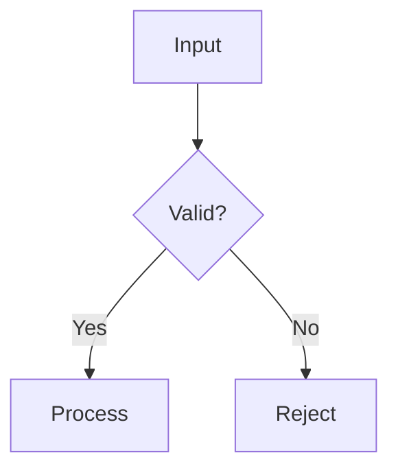

## When to Use

Create a Mermaid diagram proactively — without being asked — whenever a visual
representation would make the subject matter clearer than prose alone. Do NOT
create diagrams just to fill space; only when it genuinely aids understanding.

Good triggers:
- **Processes / workflows** — steps that happen in order or conditionally
- **Hierarchies** — taxonomies, folder structures, inheritance trees, nested concepts
- **State machines** — things that transition between states based on events
- **Relationships** — how entities connect (ER diagrams, dependency graphs)
- **Comparisons / timelines** — Gantt charts, quadrant grids, parallel tracks
- **Concept maps** — how several related ideas interlock

Skip diagrams for: simple lists, single-concept notes, pure fact cards.

## Diagram Types (choose the right one)

```
flowchart TD       – generic directed graph, default for most flows
sequenceDiagram    – actor↔actor message sequences (APIs, protocols)
classDiagram       – OOP class relationships
stateDiagram-v2    – finite state machines
erDiagram          – database / entity relationships
gantt              – timelines and schedules
mindmap            – radial concept maps
graph LR           – left-to-right flowcharts
```

## Rendering

The CLI tool is `mmdc` (installed globally via nvm).

```bash
# Render to SVG (default, lossless)
mmdc -i diagram.mmd -o diagram.svg

# Render to PNG (needed for Anki)
mmdc -i diagram.mmd -o diagram.png -w 1200

# Inline: pipe directly without a temp file
echo '...' | mmdc -i /dev/stdin -o out.png -w 1200
```

## Obsidian Integration

Obsidian renders Mermaid natively — no image needed. Embed directly in the note body:

````markdown

````

Place the diagram near the section it illustrates, not at the bottom.
Keep diagrams focused: one concept per diagram, max ~15 nodes.

## Anki Integration

Anki does not render Mermaid natively. Workflow:

1. Write the `.mmd` source to a temp file.
2. Render to PNG with `mmdc -w 1200`.
3. Pass the PNG path to `anki-ai` as an image attachment on the card.
4. Delete the temp files after sync.

Keep diagrams simple for cards — complexity defeats memorization.
A card should test one relationship or one flow segment, not an entire system.

## References

Detailed syntax and examples for each diagram type:

- **[references/class-diagrams.md](references/class-diagrams.md)** — relationships, multiplicity, stereotypes, DDD patterns
- **[references/sequence-diagrams.md](references/sequence-diagrams.md)** — actors, message types, alt/loop/par blocks, activations
- **[references/flowcharts.md](references/flowcharts.md)** — node shapes, connections, subgraphs, styling, common patterns
- **[references/mindmap.md](references/mindmap.md)** — hierarchy via indentation, node shapes, icons
- **[references/quadrant-chart.md](references/quadrant-chart.md)** — axes, quadrant labels, data points, styling
- **[references/pie-chart.md](references/pie-chart.md)** — proportional data, showData, textPosition

## Quality Rules

- Label every node and edge clearly; avoid single-letter IDs in the rendered output.
- Use `TD` (top-down) for hierarchies, `LR` (left-right) for pipelines.
- Validate syntax by running `mmdc` before embedding — a broken diagram is worse than none.
- If a diagram would need more than ~20 nodes to be complete, split it or skip it.
