# Class Diagrams

Class diagrams model object-oriented designs and domain models. They show entities (classes), their attributes/methods, and relationships.

## Basic Syntax

```mermaid
classDiagram
    ClassName
```

## Defining Classes with Members

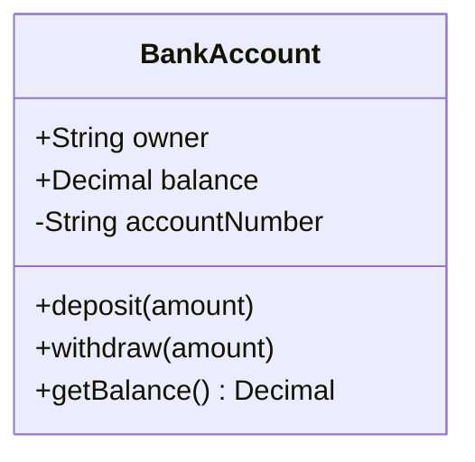

**Visibility modifiers:**
- `+` Public
- `-` Private
- `#` Protected
- `~` Package/Internal

**Member syntax:**
- `+type attribute` - Attribute with type
- `+method(params) ReturnType` - Method with parameters and return type

## Relationships

### Association (`--`)
Loose relationship where entities use each other but exist independently.

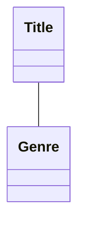

### Composition (`*--`)
Strong ownership — child cannot exist without parent. When parent is deleted, children are deleted.

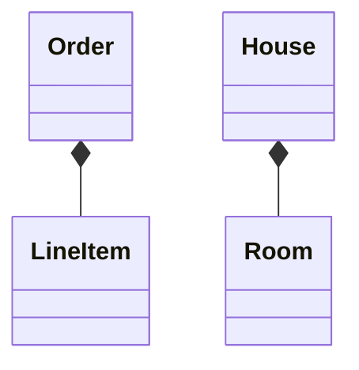

### Aggregation (`o--`)
Weaker ownership — child can exist independently. Represents "has-a" relationship.

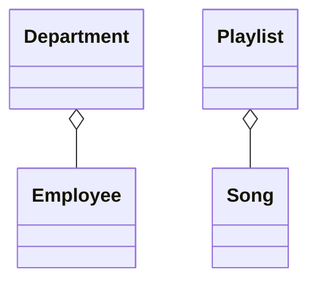

### Inheritance (`<|--`)
"Is-a" relationship. Child class inherits from parent class.

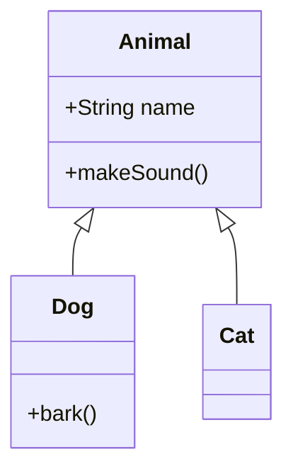

### Dependency (`<..`)
One class depends on another, often as a parameter or local variable.

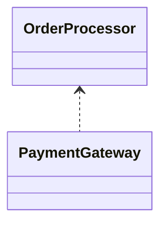

### Realization/Implementation (`<|..`)
Class implements an interface.

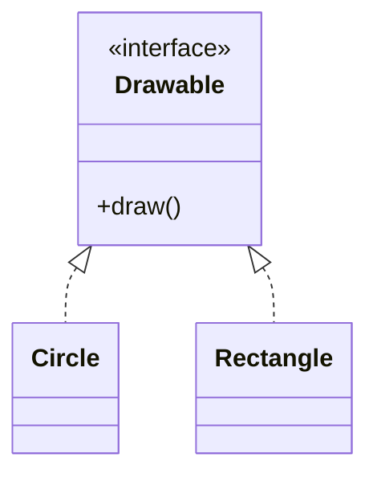

## Multiplicity

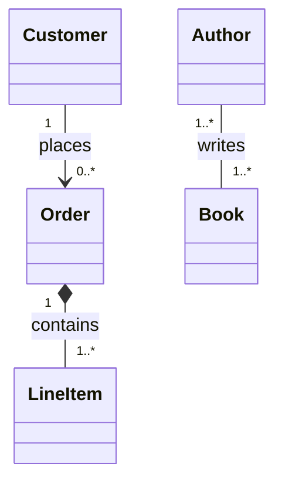

**Common multiplicities:** `1`, `0..1`, `0..*` / `*`, `1..*`, `m..n`

## Class Stereotypes

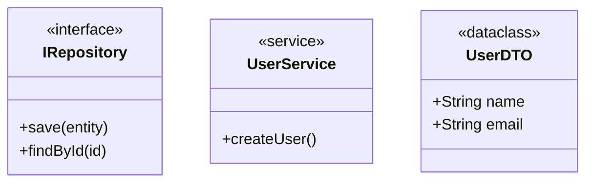

## Abstract Classes

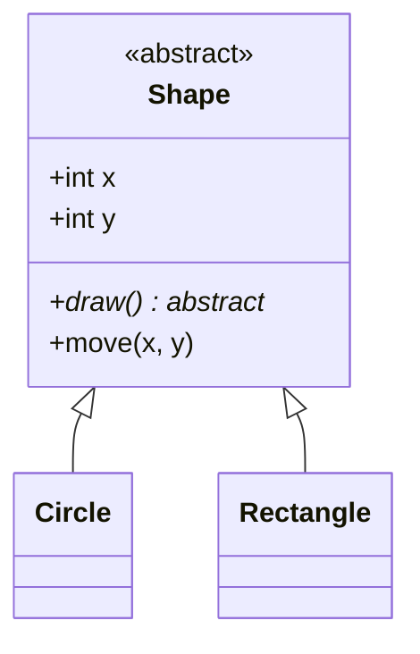

## Generic Classes

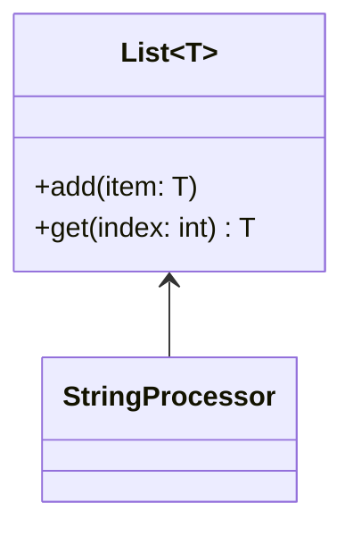

## Common Design Patterns

### Repository Pattern
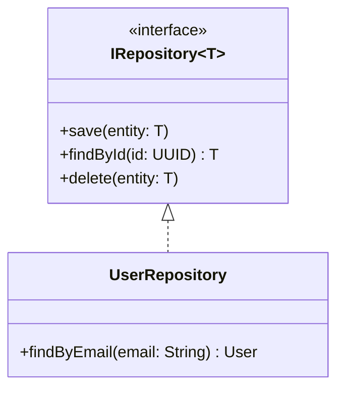

### Strategy Pattern
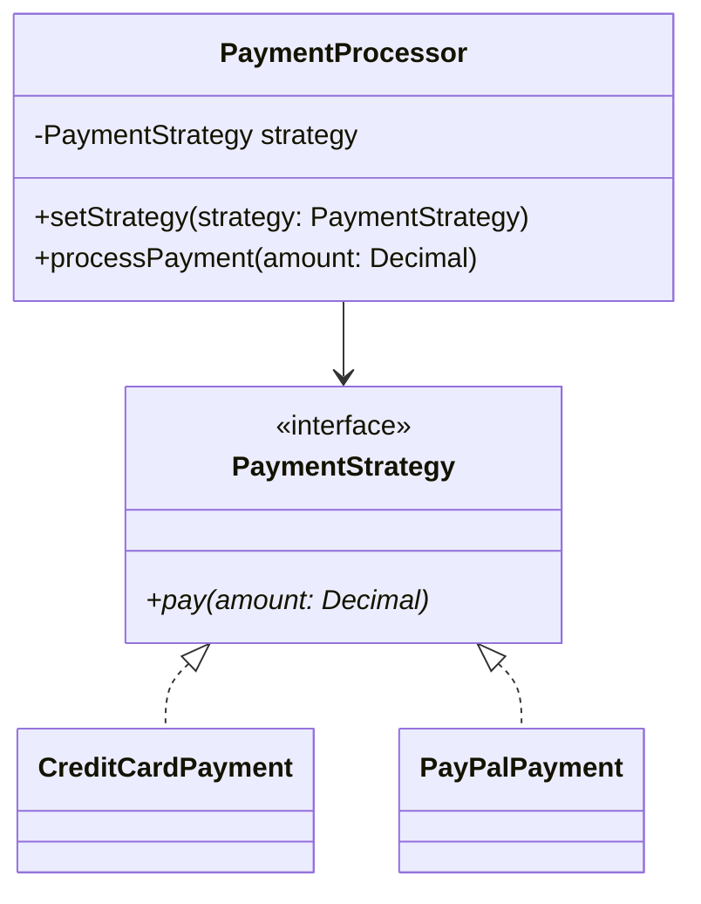

## DDD Stereotypes

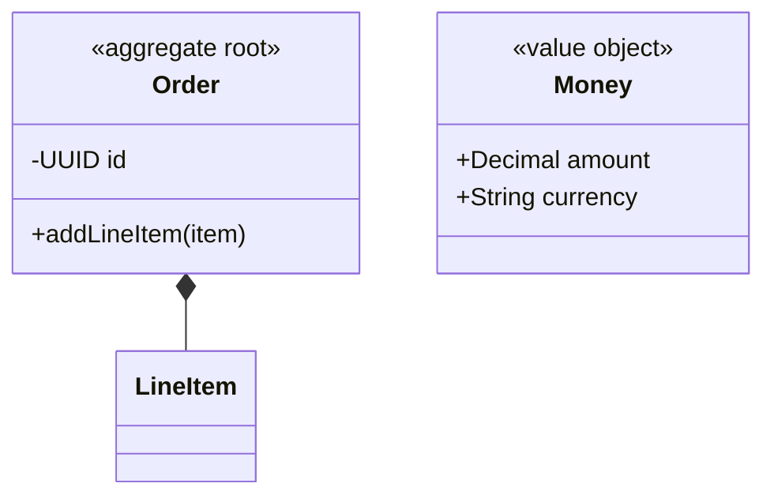

## Tips

- Start with core entities; add attributes and methods incrementally.
- Omit obvious getters/setters unless important.
- Choose between association, aggregation, and composition carefully — they carry semantic weight.
- Add multiplicity to clarify how many instances participate.
