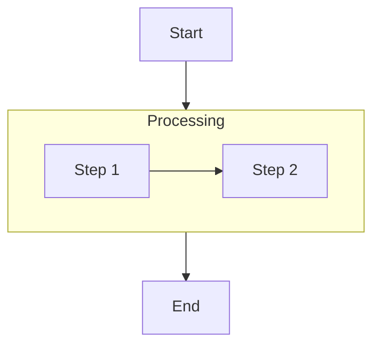
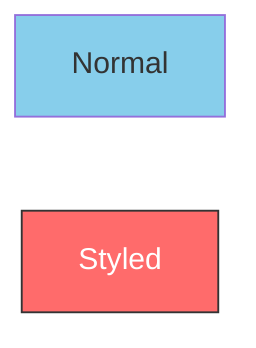
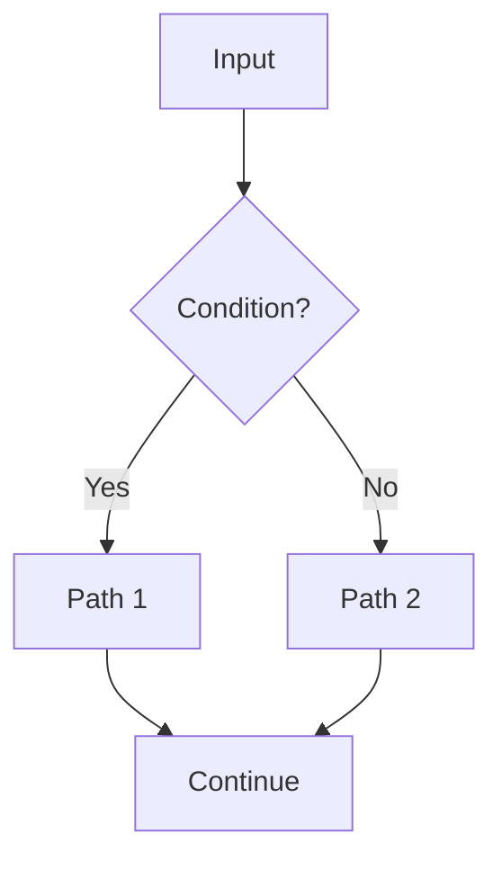
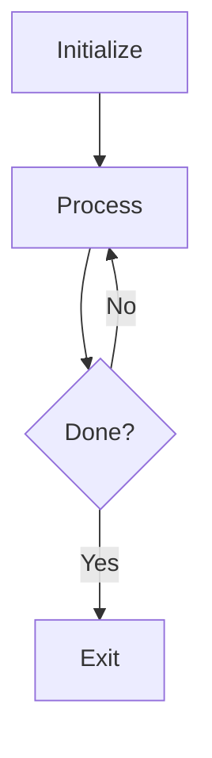
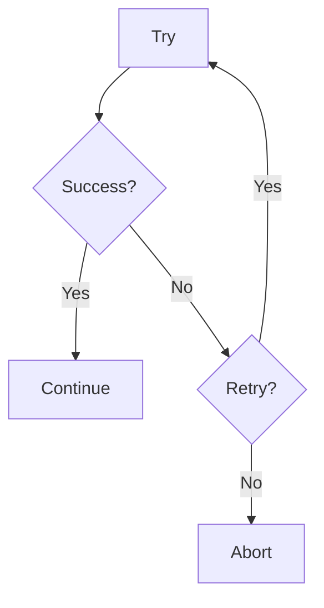

# Flowcharts

Flowcharts visualize processes, algorithms, decision trees, and user journeys.

## Directions

```
flowchart TD   – top to bottom (default)
flowchart LR   – left to right
flowchart BT   – bottom to top
flowchart RL   – right to left
```

## Node Shapes

| Shape | Syntax | Use for |
|-------|--------|---------|
| Rectangle | `A[text]` | Process step |
| Rounded | `A(text)` | Start / End |
| Stadium | `A([text])` | Terminal |
| Double border | `A[[text]]` | Subroutine |
| Cylinder | `A[(text)]` | Database |
| Circle | `A((text))` | Junction |
| Diamond | `A{text}` | Decision |
| Hexagon | `A{{text}}` | Condition |
| Parallelogram | `A[/text/]` | Input / Output |

## Connections

```mermaid
flowchart LR
    A --> B           %% solid arrow
    C --- D           %% open link (no arrowhead)
    E -->|label| F    %% labeled arrow
    G -.-> H          %% dotted arrow
    I ==> J           %% thick arrow
    K --> L & M       %% fan-out
    N & O --> P       %% fan-in
```

## Subgraphs



Subgraphs can be nested and each can have its own direction.

## Styling



## Common Patterns

### Linear flow


### Decision branch


### Loop


### Error handling


## Tips

- Use diamonds only for decisions; use rectangles for actions.
- Start and end with stadium nodes `([text])` to mark entry/exit.
- Color-code: green for start/success, red for error, yellow for storage.
- Use `TD` for hierarchies; `LR` for pipelines.
- Keep it to one process per diagram — split at natural checkpoints.
