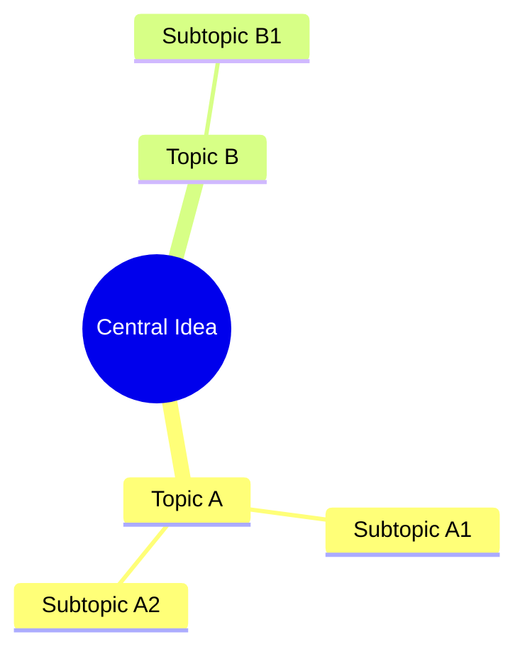
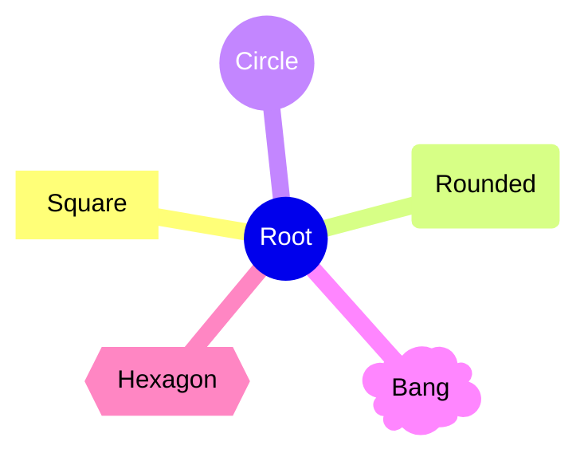
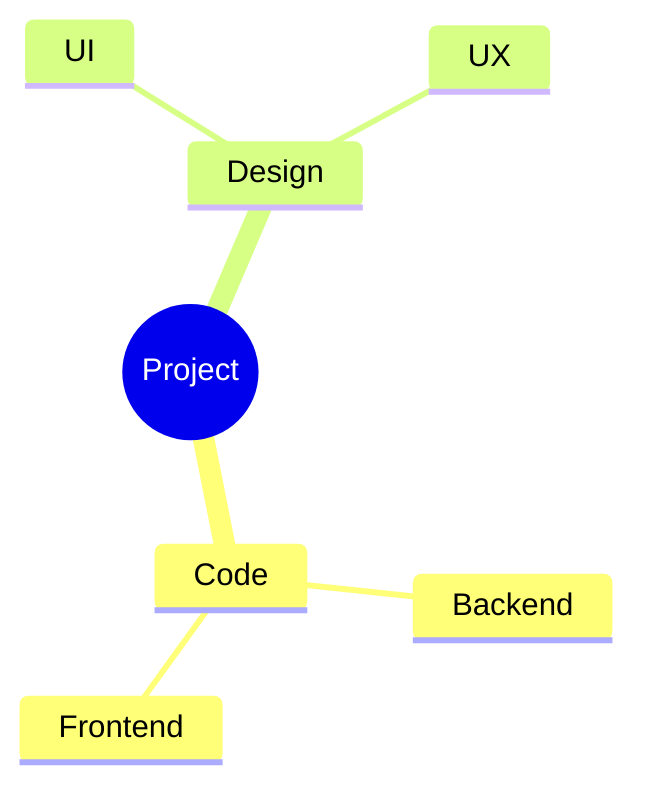
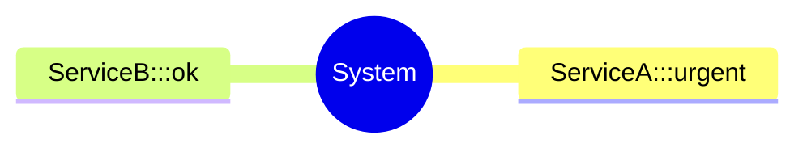
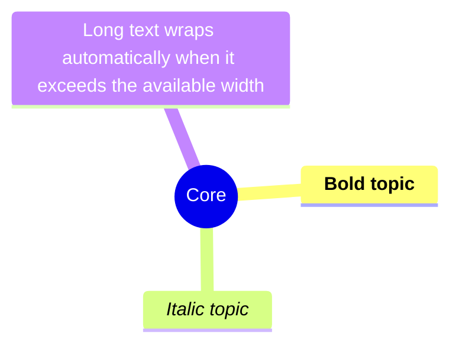
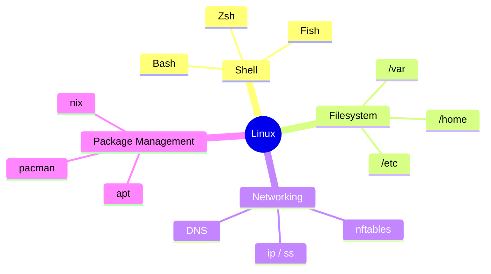

# Mindmap Diagrams

Mindmaps organize information hierarchically in a radial structure. Hierarchy is expressed through indentation — no explicit connection syntax needed.

## Basic Syntax

The root node is the first item; everything else is a child based on indentation depth.

## Node Shapes

| Shape | Syntax |
|-------|--------|
| Default (plain) | `text` |
| Square | `[text]` |
| Rounded | `(text)` |
| Circle | `((text))` |
| Bang | `)text(` |
| Cloud | `)text` or just indented |
| Hexagon | `{{text}}` |

## Icons

Add Font Awesome icons with `::icon()`:

## CSS Classes

Apply classes with `:::`:

Classes must be provided by the rendering environment.

## Markdown Text

Node labels support basic markdown formatting:

## Example: Knowledge Domain Map

## Tips

- Keep the root label short — it anchors the whole diagram.
- Limit depth to 3–4 levels; deeper hierarchies become unreadable.
- Mindmaps are best for brainstorming and concept overviews, not precise process flows.
- If a branch has more than ~6 children, consider splitting into a separate diagram.
- Available from Mermaid v9.4+.
