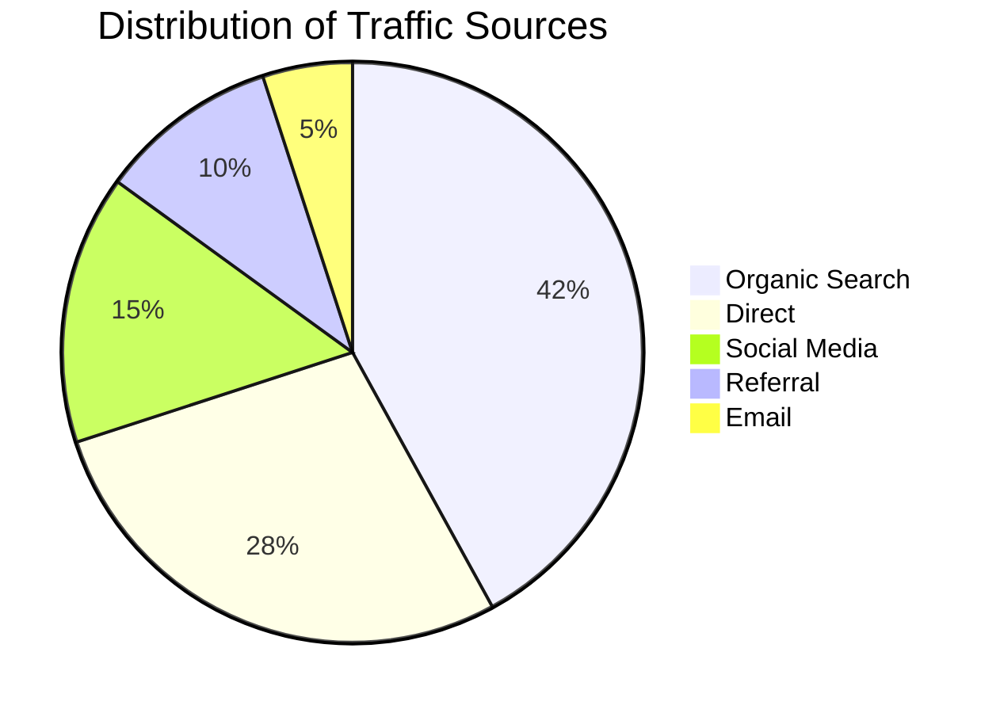
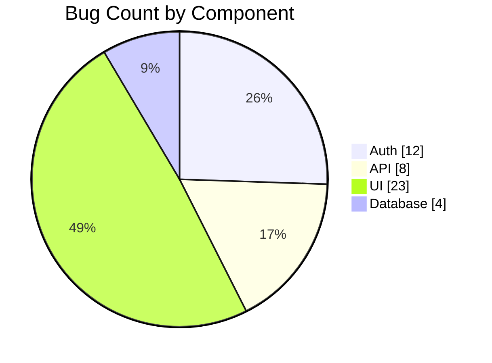
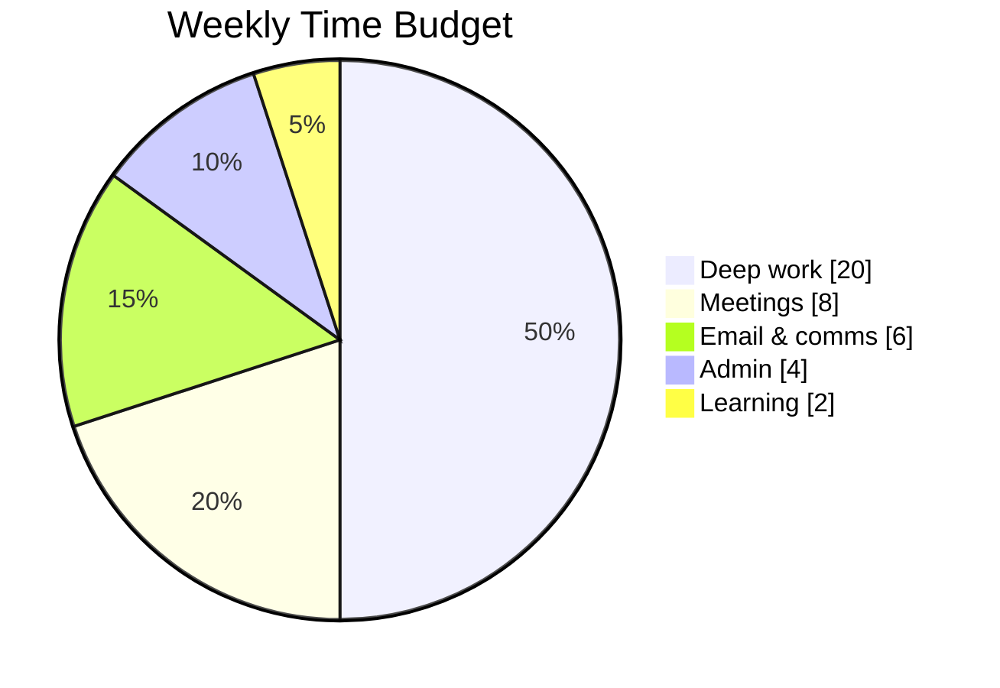

# Pie Charts

Pie charts show numerical proportions as slices of a circle.

## Basic Syntax



## Show Raw Values

Add `showData` after `pie` to display actual values alongside percentages in the legend:



## Rules

- Values must be **positive numbers** greater than zero (up to two decimal places).
- Slices render **clockwise** in the order listed.
- Labels must be in quotes.
- `title` is optional.

## Configuration

Control the radial position of slice labels (0.0 = center, 1.0 = edge):

```
%%{init: {"pie": {"textPosition": 0.6}}}%%
pie
    ...
```

Default `textPosition` is `0.75`.

## Example: Time Budget



## Tips

- Use pie charts only for **part-of-whole** relationships — not for comparing unrelated values.
- Limit to ~5–7 slices; more than that becomes unreadable.
- If you have many small slices, group them into "Other".
- For comparisons across categories, prefer a bar chart (Mermaid's `xychart-beta`).
