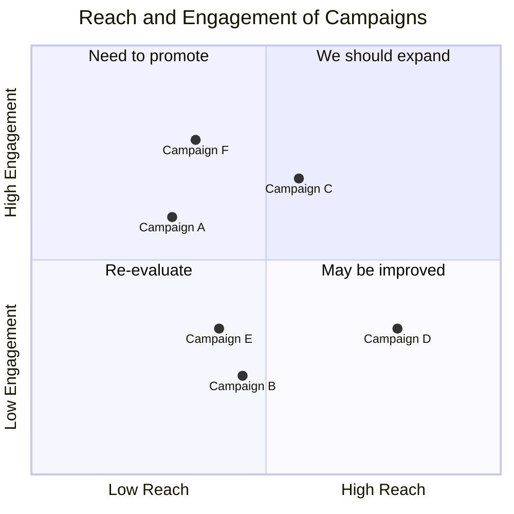
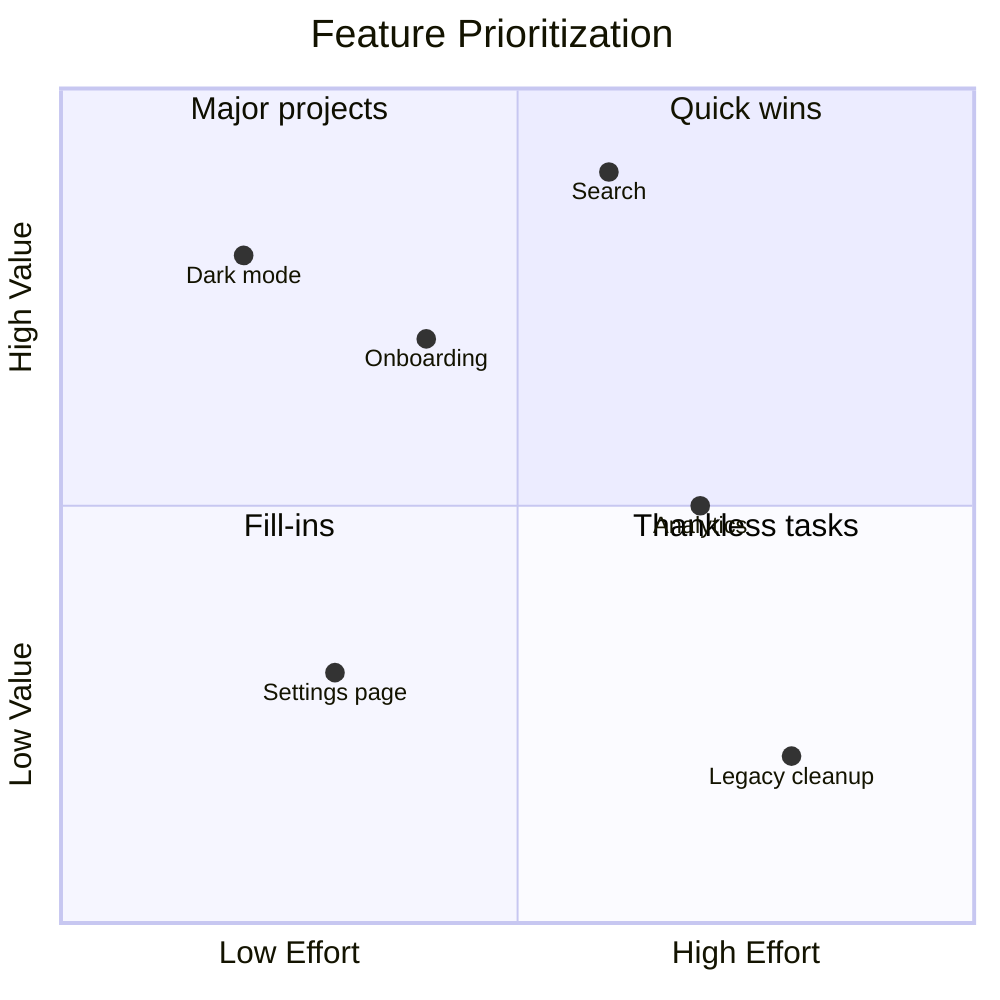

# Quadrant Charts

Quadrant charts plot data points on a two-dimensional grid divided into four sections. Useful for prioritization matrices, risk assessments, and positioning maps.

## Basic Syntax



## Axes

```
x-axis <left label> --> <right label>
y-axis <bottom label> --> <top label>
```

Single-label variant (label placed at high end):
```
x-axis High Priority
y-axis High Impact
```

## Quadrant Labels

Labels are optional. Quadrant numbering starts top-right and goes counter-clockwise:

```
quadrant-1   top-right
quadrant-2   top-left
quadrant-3   bottom-left
quadrant-4   bottom-right
```

## Data Points

```
Point Name: [x, y]
```

- `x` and `y` are floats between `0` and `1`
- Point names can contain spaces

## Point Styling

Direct style on a point:

```
Point A: [0.5, 0.5] radius: 8, color: #ff0000, stroke-color: #333, stroke-width: 2px
```

Class-based styling:

```
Point A:::myClass: [0.5, 0.5]
```

Styling priority: direct styles > class styles > theme styles.

## Configuration

```yaml
%%{init: {"quadrantChart": {"chartWidth": 400, "chartHeight": 400, "pointRadius": 5}}}%%
quadrantChart
    ...
```

| Parameter | Default |
|-----------|---------|
| `chartWidth` | 500 |
| `chartHeight` | 500 |
| `pointRadius` | 5 |
| `xAxisLabelFontSize` | 16 |
| `yAxisLabelFontSize` | 16 |
| `quadrantLabelFontSize` | 16 |

## Example: Feature Prioritization



## Tips

- Coordinates are relative (0–1), not absolute values — normalize your data first.
- Quadrant labels set the interpretive frame; choose them carefully.
- Works well for: prioritization matrices, risk maps, market positioning, effort/impact grids.
- Use consistent axis directions (low→high) to match reader expectations.
