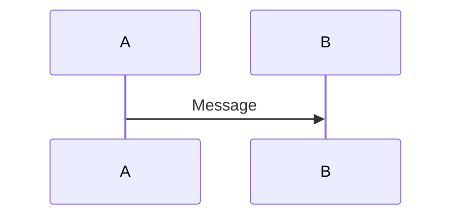
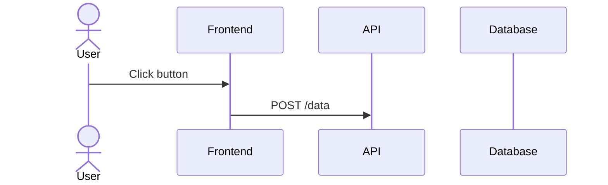
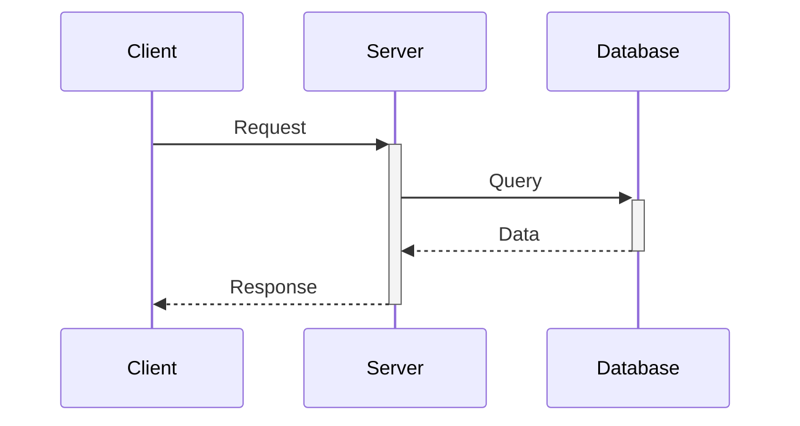
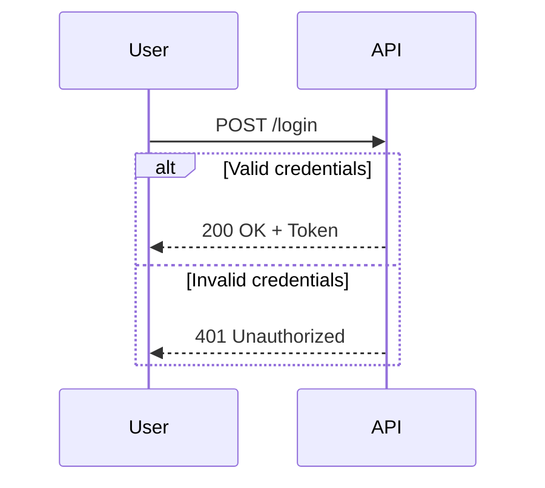
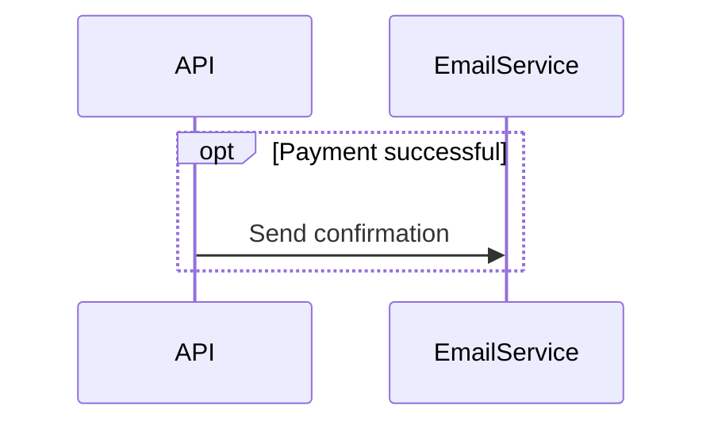
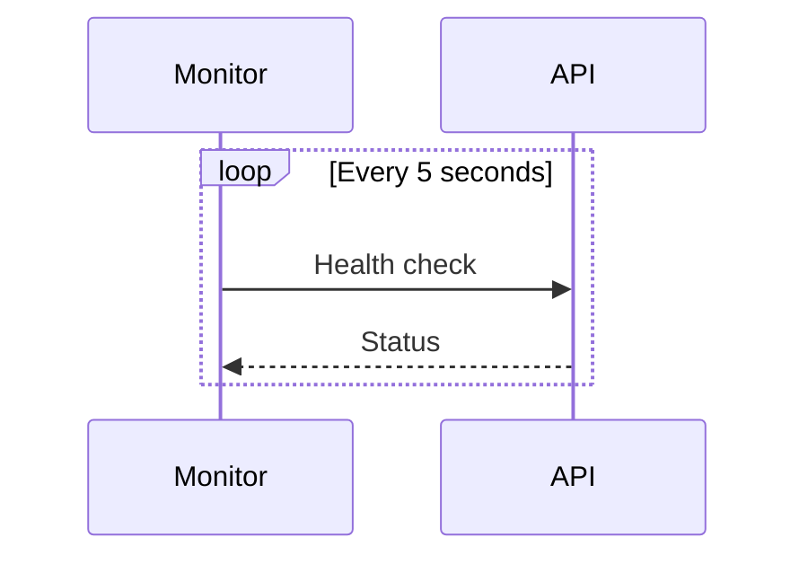
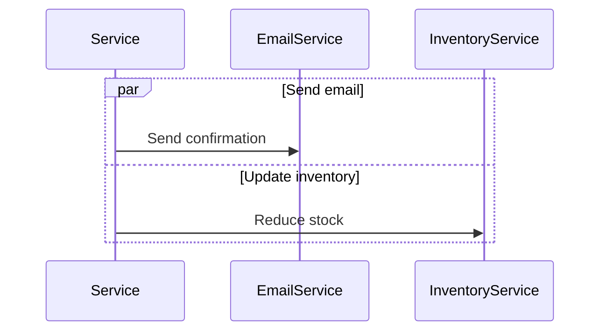
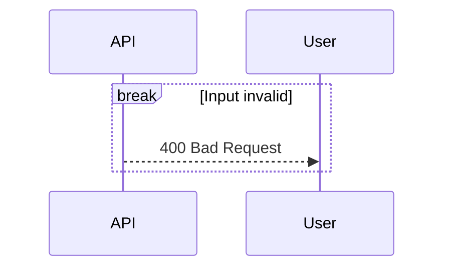
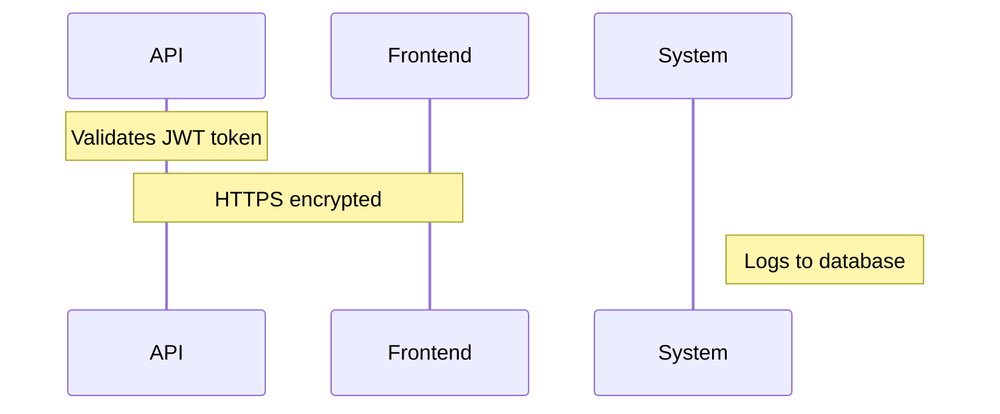
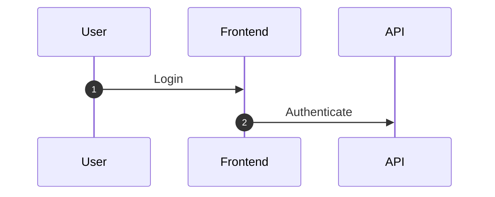

# Sequence Diagrams

Sequence diagrams show interactions between participants over time. Ideal for API flows, authentication sequences, and system component interactions.

## Basic Syntax

## Participants and Actors

- `participant` — system components (services, classes, databases)
- `actor` — external entities (users, external systems)

## Message Types

| Arrow | Meaning |
|-------|---------|
| `->>`  | Solid arrow — synchronous request |
| `-->>`  | Dotted arrow — response/return |
| `-)`   | Open solid arrow — async |
| `--)`  | Open dotted arrow — async response |
| `-x`   | Cross — delete / terminate |

## Activations

`+` after arrow activates; `-` before arrow deactivates.

## Control Flow

### Alt / Else

### Opt (optional block)

### Loop

### Par (parallel)

### Break (early exit)

## Notes

## Auto-numbering

## Tips

- Order participants: User → Frontend → Backend → Database.
- Use activations to show when components are actively processing.
- Use `alt/opt/par` to document all relevant paths including error cases.
- One scenario per diagram — don't cram happy path and all edge cases together.
- `autonumber` helps when discussing specific steps with others.
